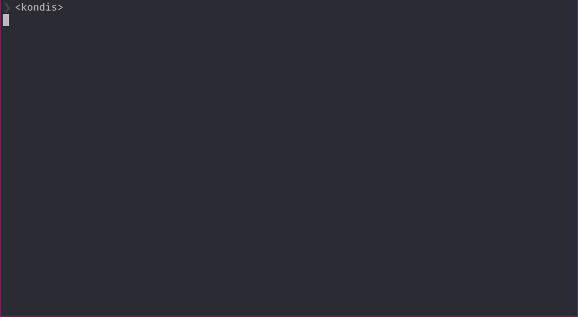

# Kondis

Cross Platform TUI Capacitance Code Calculator

Kondis is Danish/Norwegian slang for kondensator, which means capacitor..

## Install

1. `cargo build`
2. `sudo cp ./target/debug/kondis /usr/bin`
    - ms windåse users, you are on your own :<)

## mappings

* `t` : opens tolerance info sheet 
* `q` `<C>-c` `<C>-q` `<Del>` : closes the kondis TUI 
